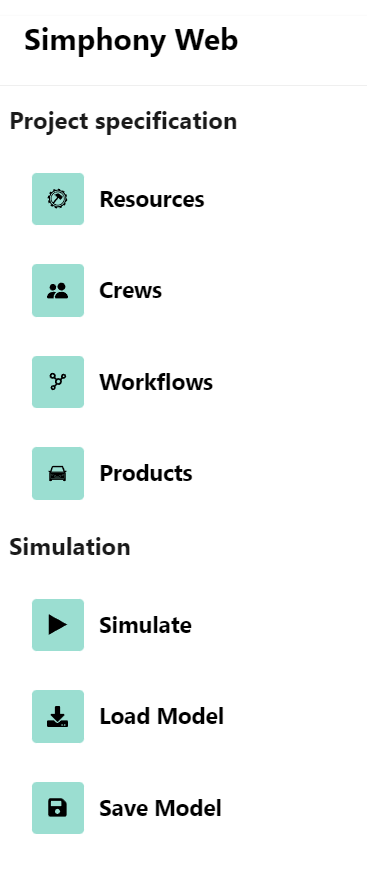
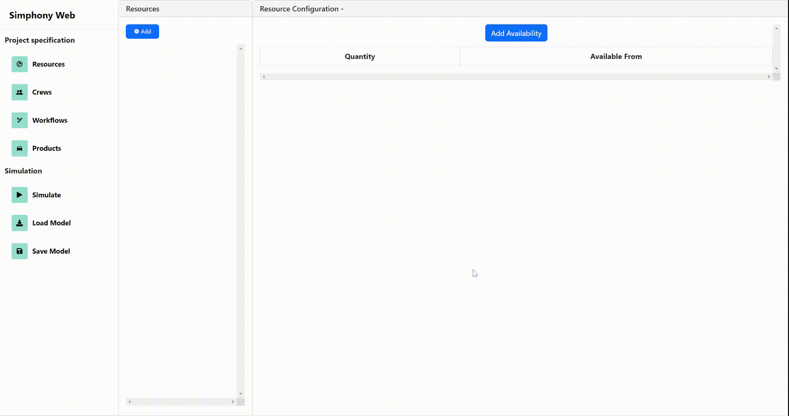
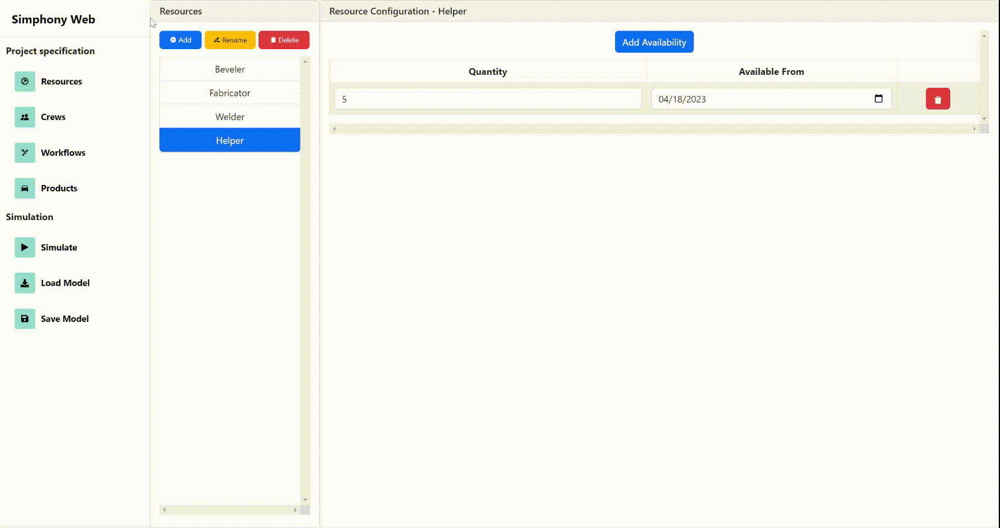
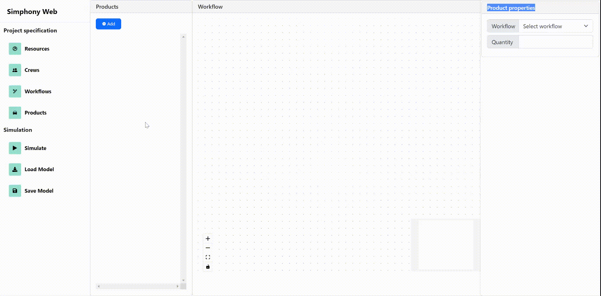

# Simphony Web Simulation UI

The Simphony Web Simulation UI allows users to run discrete event construction simulation
through a browser based UI.

There are 4 main elements that needs to be defined to simulate a scenario in the Simphony Web UI.

1. **Resources** - Any kind of manpower, equipment or machinery is defined as resources. For example, in a pipe spooling scenario, Cutters, Bevelers, Welders are resources.
2. **Crews** - Crews are collections of resources who work together to accomplish a task. For example, a Cut Crew in a pipe spooling scenario consists of Chargehands, Fabricators, Helperps and Labor
3. **Templates** - Templates are workflows that define what tasks are needed to accomplish building a type of product, in which order, the start to start lag, the finish to start lag and the finish to finish lag between the tasks.
For example, to spool a pipe, you have to do the following tasks in order: Cut -> Bevel -> Fitup -> Weld -> Post weld heat treatment -> Non-destructive testing.
4. **Products** - A product is the end result of a workflow. The end result of a pipe spooling workflow is a pipe.

Simphony Web Simulation UI is available at : https://simphonyfrontend.azurewebsites.net/

## The UI Elements

### The navigation bar

The navigation bar is on the leftmost side of the UI. There are two section in the navigation bar:

1. **Project specification** - The resources, crews, templates and products section of the UI can be accessed from this navigation section.
2. **Simulation** - This section contains the configuration needed to specify the simulation configurations and to run a simulation. It also has the option the option to load or save a model.

## Project specification

### Resources 
Clicking on the Resources navigation button will open the resources page of the Simphony Web UI. A user can configure
the resources of the project from this page.
To add resources, 
1. The user simply has to press the "**Add**" button on the top left in the "**Resources**" panel
2. Then, the user has to enter the name(s) of the resources. Multiple names can be entered using commas as shown
3. **Please note that two resources cannot have the same name.**
3. On the right hand panel, the user can edit the resource availabilities by enter values into the "**Quantity**" and "**Available From**" input boxes
4. Users can add more resource availability entries by pressing the "Add Availability" button

To rename or delete a resource:
1. First, the user has to select the resource to delete or rename by clicking in the resource name from the list of resources on the "**Resources**" panel
2. To delete the resource, the user has to click the "**Delete**" button on the top of the panel. A confirmation popup will be shown to confirm the deletion process.
3. To rename the resource, the user has to click "**Rename**" from the top of the panel. An input popup will appear and ask for the new name. 
**Please note that the new name cannot be the same as any existing resource name.**

### Crews
Clicking on the Crews navigation button will open the crews page of the Simphony Web UI. A user can configure
the crews of the project from this page.
To add crews,
1. The user simply has to press the "**Add**" button on the top left in the "**Crews**" panel
2. Then, the user has to enter the name(s) of the crews. Multiple names can be entered using commas as shown
3. **Please note that two crews cannot have the same name.**
3. On the right hand panel, the user can edit the resources of the crews by enter values into the "**Resource**" and "**Quantity**" input boxes
4. Users can add more resources by pressing the "Add Resources" button

To rename or delete a crew:
1. First, the user has to select the crew to delete or rename by clicking on the crew name from the list of crews on the "**Crews**" panel
2. To delete the crew, the user has to click the "**Delete**" button on the top of the panel. A confirmation popup will be shown to confirm the deletion process.
3. To rename the crew, the user has to click "**Rename**" from the top of the panel. An input popup will appear and ask for the new name.
   **Please note that the new name cannot be the same as any existing crew name.**

### Workflows
Clicking on the Workflows navigation button will open the Workflows page of the Simphony Web UI. A user can configure
the crews of the project from this page.
To add workflows,
1. The user simply has to press the "**Add**" button on the top left in the "**Workflows**" panel
2. Then, the user has to enter the name(s) of the Workflows. Multiple names can be entered using commas as shown
**Please note that two workflows cannot have the same name.**
3. On the right hand panel, the user can edit a workflow by adding tasks and connections.
4. A user can drag and drop a new task from the "Add a new task" button on the top left of the "Workflow" panel.
5. To add a connection between to tasks, the right black dot of the source task has to be clicked, which will initiate the connection.
Then, the left black dot of the target task has to be clicked.
4. Upon clicking on a task, a popup will appear. In this popup, the user can change the task's name, crew and productivity.
5. Upon clicking on a connection (edge), a popup will appear. 
This popup will allow the user to edit the finish to start, start to finish and finish to start lag of that connection.
6. To delete a task or a connection, simply press delete when it is selected and the popup is open.
6. The rename and delete operation are the same as resources and crews.

### Products
Clicking on the Products navigation button will open the Products page of the Simphony Web UI. A user can configure
the Products of the project from this page.
To add Products,
1. The user simply has to press the "**Add**" button on the top left in the "**Products**" panel
2. Then, the user has to enter the name(s) of the products. Multiple names can be entered using commas as shown
3. **Please note that two products cannot have the same name.**
4. In the "Product properties" panel, the user can set the workflow and quantity to be produced for a product
5. The rename and delete operation are the same as other elements of the UI.

